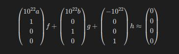

+++
date = '2025-08-17T19:32:54+01:00'
draft = false
title = 'uiuctf25 writeup: Back to Roots'
+++

## Back To Roots

writeup for the CTF challenge "Back to Roots" from uiuctf25

### Setup

-   A 10-digit number $K$ is generated.
-   $K$ is used to encrypt the flag, and we are given the resulting ciphertext.
-   We are also given the decimal part of $\sqrt K$ (i.e $\sqrt K - \lfloor \sqrt{K} \rfloor$)

---

### tl;dr

-   $ \lfloor \sqrt{K} \rfloor $ is small enough to brute force (roughly $10^5$)
-   Besides brute force, there is another solution involving the problem of finding the minimum polynomial of an algebraic number, which is a common example use case for the LLL lattice reduction algorithm.
-   Even without this prior knowledge, there is a way to approach this systematically and get an equation of the form $ax+b=y$ ($x$, $y$ unknown integers, $a$, $b$ known non-integers) which lends itself naturally to lattice techniques.

---

### Solution 1 (Brute Force)

To mathematically represent what we mean by 'decimal part of the square root', we can say $(f + l)^2 = K$ where $f$ and $K$ are unknown integers and $l = 0.433628...$ (the leak). Note that $l$ is not exact - we get 22 digits of precision.

To get a precise range for $f$, we can say $10^{10} \leq K \leq 10^{11}$, so $10^5 \leq f+l \leq 10^{5.5}$ and since $0 < l < 1$ we can say $10^5 -1 \leq f \leq 10^{5.5}$ (a precise range isn't really needed as the range is small enough even if you go from $1$ to $10^6$)

This small enough (~20000 values or ~18 bits of entropy) to loop through each $f$ and check that $(f+l)^2$ is close to an integer (close, not exact, because the exact value of $l$ is not given)

As for "How close is close enough?", it is possible to check how close it should be given the precision of $l$ (and floating point precision if you use floats), but to save time and effort, I just tried random thresholds until I cut it down to 5 results where I could manually check each for the flag (decrypted using the same method as the challenge script)

This isn't required but it is possible to speed up the search a little bit: $(f+l)^2 = f^2 + 2fl + l^2$. Removing the $f^2$ doesn't affect how close it is to an integer so we can just check for $2fl + l^2$ being close to an integer. $2l$ and $l^2$ can be precomputed to save even more time.

Also, it is worth noting that the hash function (md5) and AES mode (ECB) used to encrypt are not completely secure, but their use doesn't give us advantages here.

---

```python
# solve.py
from math import floor, ceil
from hashlib import md5
from Crypto.Cipher import AES
from Crypto.Util.Padding import unpad

def decrypt(f, ct):
    K = round((f+leak)**2)
    ob = AES.new(
        md5(f"{K}".encode()).digest(),
        AES.MODE_ECB
    )
    pt = ob.decrypt(bytes.fromhex(ct))
    print(pt)


leak = 0.4336282047950153046404
ct = "7863c63a4bb2c782eb67f32928a1deceaee0259d096b192976615fba644558b2ef62e48740f7f28da587846a81697745"

lsq = leak*leak

for f in range(10**5, ceil(10**5.5) + 1):
    int_check = 2*f*leak + lsq
    int_dist = abs(round(int_check)-int_check)
    if int_dist < 0.00001:
        decrypt(f, ct)
```

### Solution 2 - lattices and algebraic numbers

If you are familiar with algebraic numbers, you might notice that $l = 0.433628...$ is an algebraic number, that is, there is a polynomial with integer coefficients with $l$ as a root. As described in solution 1, we have $(f+l)^2 = K$ where $f$ and $K$ are unknown integers. This is a polynomial in $l$ of degree $2$ - we can make this more explicit by writing it as $l^2 + bl + c = 0$ with $b=2f$ and $c=f^2-K$.

Note that because $l$ is irrational, any polynomial that has $l$ as a root must be of degree at least 2, meaning the polynomial we have above is a minimal (degree) polynomial for $l$

There happens to be a property of algebraic numbers where there is only one unique minimal degree polynomial. This means that if we manage to find another degree-2 polynomial that has $l$ as a root, it must be the same polynomial as the one above, and we can read off the coefficients to recover $f$ and $K$.

Luckily, there also happens to be an algorithm for finding the minimal degree polynomial of an algebraic number. This algorithm uses LLL, and it seems to be a common example for applications of LLL (at least, it was the first example in [two](https://eprint.iacr.org/2023/032.pdf#subsection.3.6) [separate](https://youtu.be/U8MI2a_BHHo?t=925&si=2XLS2kEeF8cl2grC) learning resources that I used myself).

To relate it to other LLL applications, it is essentially just solving $al^2 + bl + c \approx 0$ with unknown integers $a,b,c$. Note that we multiply everything by $10^{22}$ and round so that we can work with integers. Here, we know that the best solution is the unique minimal polynomial of $l$, with $a=1, b=2f,c=f^2-K$. Once we run LLL and solve for $K$, we can decrypt the flag, the same way as in solution 1.

```python
# solve.sage
l = 0.4336282047950153046404

prec = 10^22

at = round(l*prec)
bt = round(l*l*prec)

M = Matrix(ZZ, [
    [prec, 1, 0, 0],
    [at, 0, 1, 0],
    [bt, 0, 0, 1]
]).LLL()

row = M[0]  # smallest vector in first row
print(row[3] == 1)  # hope for True, so that polynomial is monic

const = row[1]  # f^2 - K
ft2 = row[2]  # f*2

f = ft2//2
K = f^2 - const

print(K)
```

---

### Solution 3

As described in solution 1, we have $2fl+l^2$ is an integer (up to 22 digits precision) with $l = 0.433628...$ and integer $f$ where $(f+l)^2 = K$ (up to 22 digits precision)

If we write $h = 2fl + l^2$, $a = 2l$, $b=l^2$ then the problem becomes $af + b = h$ ($f$, $h$ unknown integers, $a$, $b$ known non-integers)

We can write this as an integer linear combination so that it can be solved with LLL: $af + bg + (-1)h = 0$. Then by multiplying by $10^{22}$, rounding and writing as vectors, we get this:

 (screenshot from obsidian because I can't get column vectors to work with hugo)

After running LLL we get $g = 1$ as we hoped, so we can extract coefficients and get $K$.

```python
# solve.sage
l = 0.4336282047950153046404

prec = 10^22

at = round(l*prec)
bt = round(l*l*prec)

M = Matrix(ZZ, [
    [2*at, 1, 0, 0],
    [bt, 0, 1, 0],
    [-prec, 0, 0, 1]
]).LLL()

row = M[0]  # smallest vector in first row
print(row[2] == 1)  # hope for True

f = row[1]
const = row[3]  # K - f^2

K = const + f^2
print(K)
```
